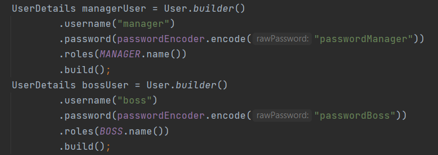
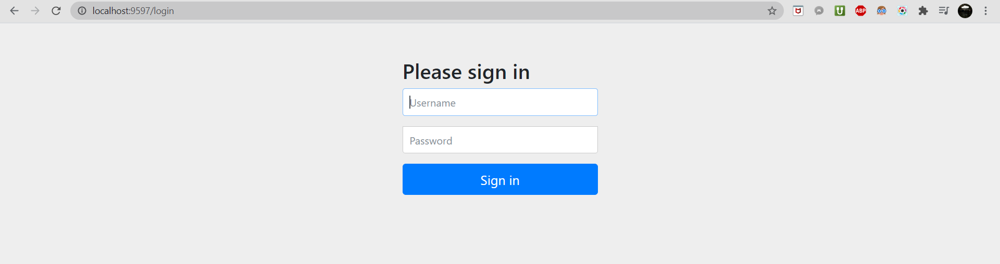
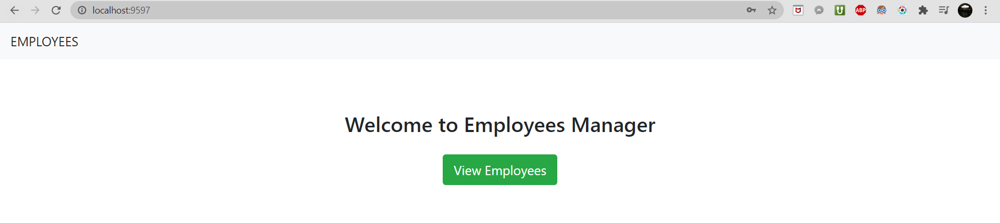
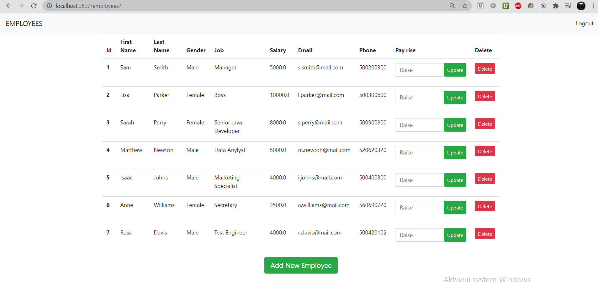
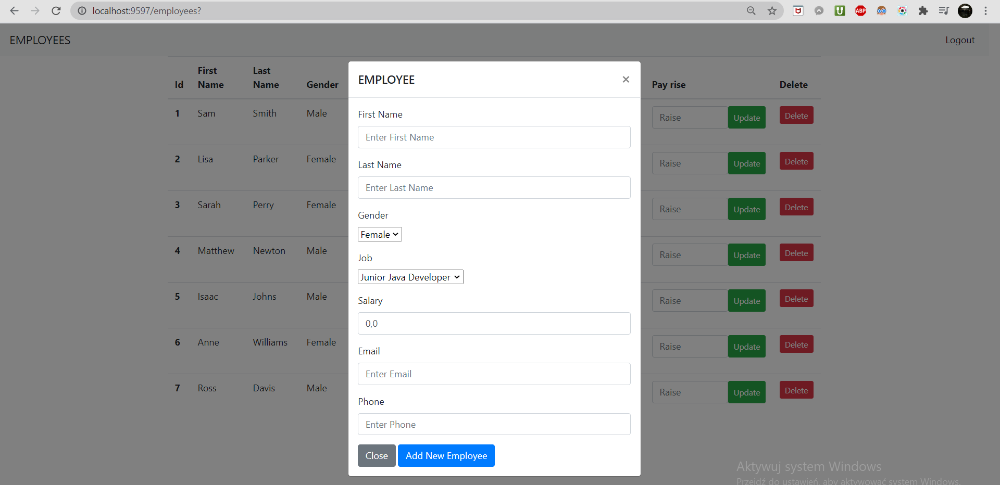

# Employees_Manager_App

## Table of contents
* [General info](#General_info)
* [Staring application](#Staring_application)
* [Screenshots](#Screenshots)
* [Features](#Features)
* [Features in progress](#Features_in_progress)
* [Technologies](#Technologies)

## General info
This project is simple employees data manager

## Staring application
* Run application
* Get access to application on http://localhost:9597/
* Log in to application by one of the users:

## Screenshots

## Features
* User Authentication - login and logout page created by Spring Security
* Password Encoding - used BCrypt
* Storing Employees data in H2 database - enabled adding, deleting and uptading
* User-friendly interface created by HTML and a bit of CSS
* Roles and User Permission given to different users

### Features in progress
* Storing users logins and passwords in external database
* Executing roles and permissions - for example only boss can give a raise etc.
* Blocking incorrect data inputs
* Improving view of the application

## Technologies
Project is created with:
* Spring Boot, Spring Security and Spring Data
* Java
* HTML
* CSS
